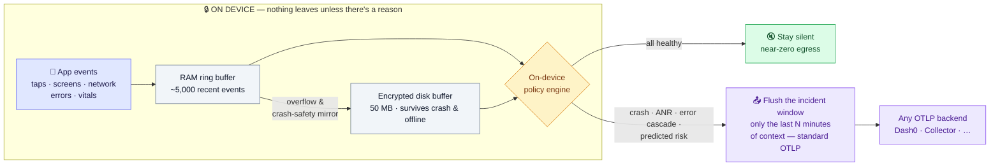
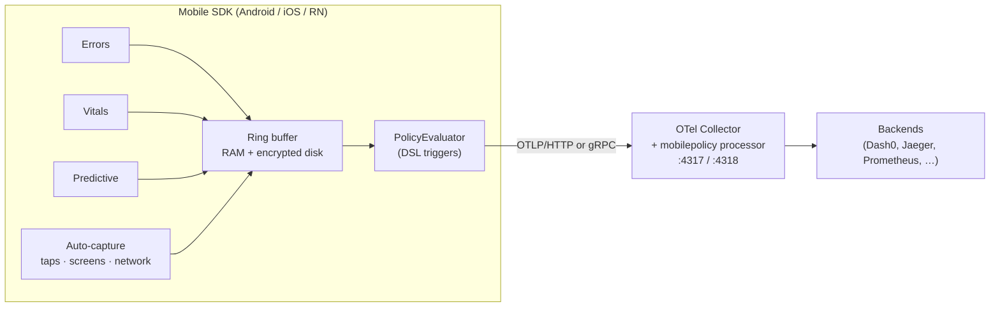

# Mobile OTel SDK

**OpenTelemetry-native mobile observability for Android, iOS & React Native — that doesn't stream a firehose of every event off the device.**

Most mobile RUM SDKs collect everything and upload it all. This one keeps the data on the device in a crash-safe buffer, runs a policy engine *on the device*, and — in `CONDITIONAL` mode — exports **only the window of events around an actual problem** (a crash, an ANR, an error cascade). Same incident context, a fraction of the data egress, 100% standard OTLP so nothing is locked to one vendor.

[](https://github.com/barrysolomon/mobile-otel/actions/workflows/ci.yml)
[](https://www.npmjs.com/package/@barrysolomon/mobile-react-native)


[](LICENSE)


> **Current release: `0.5.1-alpha`** — published for Android (GitHub Packages), iOS (SwiftPM), and React Native (npm `@barrysolomon/mobile-react-native@alpha`). See the [Changelog](CHANGELOG.md) for full notes.
> **Side note — management plane:** the gateway, control-plane UI, and k8s manifests live in a separate repo, `mobile-otel-control-plane`. It's an early **work in progress**, currently a **private repo** and **not yet usable by others**. If you're interested in it, reach out — I'm happy to grant access to anyone who wants to help move it along.

## The idea in one diagram



**How to read it:** a stream-everything RUM SDK would take the full contents of that RAM buffer and upload it continuously — every event, from every user, all the time. This SDK keeps the stream **on the device** and exports only the **incident window** (the 🔇→📤 branch): the minutes of context around a real crash, ANR, or error cascade. The rest of the time it stays silent. Same root-cause context, a fraction of the data egress, 100% standard OTLP.

## What It Does

The SDK captures telemetry locally in a two-tier ring buffer (RAM + SQLite), evaluates export policies on-device, and selectively flushes only relevant event windows. This dramatically reduces data egress while preserving full context around problems.

**Key capabilities:**

- **Auto-instrumentation** — Errors, vitals, predictive health, UI interactions all wired automatically
- **Two-tier buffering** — RAM (5000 events) -> disk (50MB, 24h TTL), survives crashes and offline
- **Conditional export** — Zero bandwidth when nothing goes wrong (CONDITIONAL mode)
- **Selective flush** — Export last N minutes around a problem, not everything
- **Predictive flush** — Pre-emptive export when crash risk or network loss risk is high
- **Remote kill switch** — Disable the SDK or cap sampling fleet-wide over signed remote config (`sdk.enabled` / `sample_rate`)
- **Transport security** — HTTPS enforced by default (cleartext rejected unless `allowInsecureTransport`), optional cert/public-key pinning, HMAC-signed remote config
- **At-rest encryption** — Android disk buffer encrypted (SQLCipher + Keystore), parity with iOS `NSFileProtection`

## How it differs from typical mobile RUM

| | This SDK | Typical mobile RUM (Datadog, Sentry, Embrace) |
| --- | --- | --- |
| **Export model** | On-device policy engine; `CONDITIONAL` mode flushes only the window around an incident | Continuous — all events batched and uploaded |
| **Data egress** | Scales with *incidents*, not users (`<0.5%` battery in conditional mode) | Scales with users/sessions |
| **Offline / crash** | Two-tier RAM→encrypted-disk buffer; context survives crash and offline, flushed on next launch | Varies; often lossy across crashes |
| **Wire format** | 100% standard **OTLP** — point it at any OTLP backend | Mostly proprietary ingest + pricing |
| **Selective flush** | "Export the last N minutes around this crash" | Not possible — data sent in arrival order |
| **Platforms** | Android, iOS, React Native (one shared native core) | Broad, mature |

**Where established RUM is still ahead today** (this is alpha, and honesty matters): production maturity at scale, crash symbolication/de-obfuscation, a session-replay *viewer*, and native (NDK/C++) crash capture. The bet here is architecture and openness — see [WHY_THIS_SDK.md](WHY_THIS_SDK.md) and the [battle cards](docs/).

## Quick Start

> **Fastest path:** React Native installs straight from npm with no auth —
> `npm install @barrysolomon/mobile-react-native@alpha`. The Android SDK currently
> publishes to GitHub Packages, which needs a `read:packages` PAT (see below);
> Maven Central distribution is on the roadmap. To just *see it work*, run the
> bundled demo — [HOW_TO_DEMO.md](HOW_TO_DEMO.md).

### Android SDK Integration

Add the dependency from GitHub Packages (artifact `io.opentelemetry.android:mobile:0.5.0-alpha`). Consuming GitHub Packages requires a GitHub personal access token with the `read:packages` scope:

```kotlin
// settings.gradle.kts (or build.gradle.kts repositories block)
repositories {
    maven {
        url = uri("https://maven.pkg.github.com/barrysolomon/mobile-otel")
        credentials {
            // A GitHub PAT with read:packages
            username = providers.gradleProperty("gpr.user").orNull ?: System.getenv("GITHUB_ACTOR")
            password = providers.gradleProperty("gpr.token").orNull ?: System.getenv("GITHUB_TOKEN")
        }
    }
}

// app/build.gradle.kts
dependencies {
    implementation("io.opentelemetry.android:mobile:0.5.0-alpha")
}
```

> The full module set publishes to GitHub Packages as of 0.2.0-alpha — `io.opentelemetry.android:mobile` (the umbrella) plus `mobile-core` and all `mobile-instrumentation-*` modules — so the dependency tree resolves cleanly.

```kotlin
// In Application.onCreate()
OTelMobile.start(this, MobileConfig(
    serviceName = "my-app",
    serviceVersion = "1.0.0",
    // Default protocol is OTLP HTTP/protobuf; the SDK POSTs to
    // <endpoint>/v1/{logs,traces,metrics}. One endpoint works for Android + iOS.
    collectorEndpoint = "https://collector.example.com:4318"
    // For a gRPC-only collector: protocol = OtlpProtocol.GRPC (typically :4317)
))

// That's it. All auto-instrumentation is now active:
// - Error capture (uncaught, coroutine, RxJava) -> auto flush
// - Vitals (app start, jank, memory, thermal) -> OTel metrics
// - Predictive export (crash/network risk -> pre-emptive flush)
// - Auto-capture (taps, scrolls, freezes, ANR, lifecycle)
// - Ring buffer + policy evaluation
```

**Sending to Dash0?** Pass your auth token and dataset name via `headers`:

```kotlin
// In Application.onCreate()
OTelMobile.start(this, MobileConfig(
    serviceName = "my-app",
    serviceVersion = "1.0.0",
    collectorEndpoint = "https://ingress.us-west-2.aws.dash0.com", // or eu-west-1; OTLP/HTTP default
    headers = mapOf(
        "Authorization" to "Bearer auth_...",
        "Dash0-Dataset" to "otel-mobile"
    )
))
```

### Optional: Custom Events & Error Reporting

```kotlin
// Send custom events
MobileOtel.sendEvent("checkout.completed", mapOf(
    "item_count" to 3,
    "total" to 42.99
))

// Report caught exceptions
try { riskyOperation() } catch (e: Exception) {
    MobileOtel.reportError(e, mapOf("context" to "checkout"))
}

// Coroutine error handling
val scope = CoroutineScope(
    Dispatchers.IO + MobileOtel.getCoroutineExceptionHandler()!!
)

// User identity
MobileOtel.identify(UserIdentity(userId = "user123"))

// Manual flush (all or windowed)
MobileOtel.forceFlush()              // Flush everything
MobileOtel.forceFlush(windowMinutes = 5)  // Last 5 minutes only
```

### Optional: Network Instrumentation

```kotlin
// Add OTel interceptor to your OkHttpClient
val client = OkHttpClient.Builder()
    .addInterceptor(OTelNetworkInterceptor.create(
        context = applicationContext,
        config = NetworkConfig.production(),
        tracer = OTelMobile.getTracer("network"),
        propagator = openTelemetry.propagators.textMapPropagator
    ))
    .build()
```

### iOS SDK Integration (SwiftPM)

Add the package in Xcode (**File → Add Package Dependencies…**) or in `Package.swift`, pointing at tag `v0.5.0-alpha`, and depend on the `OTelMobileSDK` product:

```swift
// Package.swift
dependencies: [
    // SwiftPM resolves the git tag literally — the release tag is v0.5.0-alpha
    .package(url: "https://github.com/barrysolomon/mobile-otel", .exact("v0.5.0-alpha"))
],
targets: [
    .target(name: "MyApp", dependencies: [
        .product(name: "OTelMobileSDK", package: "mobile-otel")
    ])
]
```

```swift
// App startup
import OTelMobileSDK

let otel = try OTelMobile.start(config: MobileConfig(
    serviceName: "my-app",
    serviceVersion: "1.0.0",
    endpoint: "https://collector.example.com:4318"  // OTLP HTTP/protobuf
))
```

**Sending to Dash0?** Pass your auth token and dataset name:

```swift
import OTelMobileSDK

let otel = try OTelMobile.start(config: MobileConfig(
    serviceName: "my-app",
    serviceVersion: "1.0.0",
    endpoint: "https://ingress.us-west-2.aws.dash0.com",  // or eu-west-1
    authToken: "auth_...",          // sets Authorization: Bearer <token>
    extraHeaders: ["Dash0-Dataset": "otel-mobile"]
))
```

> Screenshot and wireframe capture default **OFF** on iOS. Opt in via `screenshotConfig` / `wireframeConfig`, and provide a `shouldCapture` consent gate (a `CaptureConsentGate`) to decide per-capture whether to record.

### React Native Integration (npm)

Install under the **`alpha`** dist-tag — a bare install resolves the older 0.1.0-alpha:

```bash
npm install @barrysolomon/mobile-react-native@alpha
# or pin exactly:
npm install @barrysolomon/mobile-react-native@0.5.0-alpha
```

```ts
import OTelMobile from '@barrysolomon/mobile-react-native';

await OTelMobile.start({
  serviceName: 'my-app',
  endpoint: 'https://collector.example.com:4318',
  // RN manual spans default to always-on sampling (strategy: 'always_on').
  // Opt back into on-device sampling explicitly:
  // sampling: { strategy: 'dynamic', normalRate: 0.1 },
});
```

**Sending to Dash0?** Use the dedicated `authToken` and `dataset` fields:

```ts
import OTelMobile from '@barrysolomon/mobile-react-native';

await OTelMobile.start({
  serviceName: 'my-app',
  endpoint: 'https://ingress.us-west-2.aws.dash0.com', // or eu-west-1
  authToken: 'auth_...',
  dataset: 'otel-mobile',
});
```

> RN is a thin JS facade over the native Android + iOS SDKs — buffering, policy evaluation, and OTLP export happen natively. On Android, native network instrumentation injects W3C `traceparent` so mobile→backend traces stitch (Expo SDK 52+ `expo/fetch` safe).

## Project Structure

```text
mobile-otel/
├── otel-android-mobile/          # Android SDK library (Kotlin, JDK 17)
│   └── src/main/java/.../mobile/
│       ├── MobileOtel.kt         # Facade — wires all modules, public API
│       ├── OTelMobile.kt         # Auto-capture entry point (delegates to MobileOtel)
│       ├── buffering/            # Two-tier ring buffer (RAM + SQLite)
│       ├── config/               # MobileConfig, NetworkConfig, etc.
│       ├── errors/               # ErrorInstrumentation (uncaught, coroutine, RxJava)
│       ├── export/               # EnrichingLogRecordExporter, RetryableExporter
│       ├── policy/               # PolicyEvaluator (DSL engine)
│       ├── predictive/           # PredictiveExportPolicy, DeviceHealthMonitor
│       └── vitals/               # VitalsCollector, JankDetector, AppStart
│
├── otel-android-mobile-core/     # Core non-UI subsystems (builder, hub, context)
│
├── instrumentation/              # Modular instrumentation (21 modules; core 10 shown)
│   ├── tap/                      # Touch, long-press, swipe detection
│   ├── scroll/                   # RecyclerView scroll tracking
│   ├── screen/                   # Screen view + page span lifecycle
│   ├── text-input/               # EditText focus-leave events
│   ├── back-press/               # Hardware back button
│   ├── freeze/                   # App freeze / ANR detection
│   ├── errors/                   # Uncaught exceptions, coroutine errors
│   ├── lifecycle/                # Activity/fragment lifecycle tracking
│   ├── network/                  # OkHttp interceptor
│   └── vitals/                   # Memory, battery, jank, app-start metrics
│
├── collector-processor/          # Custom OTEL Collector processor (Go)
│   └── mobilepolicyprocessor/
│
├── examples/
│   ├── demo-app/                 # Schedulr — full-featured demo (medical scheduling)
│   ├── demo-app-starter/         # Minimal starter template for new integrations
│   └── demo-backend/             # Express.js/TypeScript booking API (OTel-instrumented)
│
├── dashboards/                   # Dash0 dashboard JSON definitions (Perses format)
├── docs/                         # Full documentation suite (see docs/README.md)
├── DESIGN.md                     # Architecture & design document
├── BACKLOG.md                    # Prioritized remaining work
└── HOW_TO_DEMO.md                # Full demo runbook (2 emulators, 12 min)
```

## Architecture



The optional `mobilepolicyprocessor` (Go) lets the *collector* apply the same policy DSL server-side; the SDK works against any plain OTLP endpoint without it.

## Export Modes

| Mode | Behavior | Battery Impact |
| --- | --- | --- |
| **CONDITIONAL** | Export only when policy triggers match | <0.5% |
| **CONTINUOUS** | Periodic export (traces 30s, metrics 60s) | 3-5% |
| **HYBRID** | Periodic + trigger-based | 1-2% |

## Flush Triggers

1. **Policy match** — DSL conditions met (ui.freeze, crash, http 5xx cascade)
2. **Error capture** — Uncaught exception / coroutine / RxJava error -> immediate flush
3. **Predictive** — Crash risk >= 0.7 or network loss risk >= 0.7 -> pre-emptive flush
4. **Low memory** — Android ComponentCallbacks2 memory pressure signal
5. **App recovery** — Crash/ANR/force-quit marker detected on next launch
6. **Manual** — `MobileOtel.forceFlush()` or `forceFlush(windowMinutes = 5)`
7. **Periodic** — CONTINUOUS/HYBRID mode timers

## Technology Stack

| Component | Key Dependencies |
| --- | --- |
| Android SDK | Kotlin, OpenTelemetry SDK 1.58.0, Room 2.8.4, OkHttp 4.12.0, Coroutines 1.10.2, SQLCipher (at-rest encryption) |
| iOS SDK | Swift 5.9, opentelemetry-swift 2.1.x, swift-collections 1.1.x |
| React Native | TypeScript facade over the native Android + iOS SDKs |
| Demo Backend | TypeScript, Express.js 4.21, better-sqlite3, OTel SDK Node 0.57.0 |
| Collector Processor | Go 1.24, OpenTelemetry Collector 1.39.0 |

## Testing & Quality Gates

Green means delivered, not just compiled — see [docs/TESTING_GUIDE.md](docs/TESTING_GUIDE.md):

- **1237 unit tests** per push, plus an R8 minified-consumer gate and a 700 KB AAR size budget.
- **Device suites** (Android instrumented + the 530-test iOS simulator suite) run nightly, on every release tag, and on demand (`gh workflow run device-tests.yml`).
- **Dash0 receipt gates** (`scripts/e2e/`): e2e runs pass only when the telemetry each platform's demo emits actually lands in Dash0, scoped to that run.
- **Startup budget enforced**: `OTelMobile.start()` keeps main-thread work under 50 ms (heavy init — Keystore, disk buffer, exporters — happens on background threads).
- **Publishing refuses red commits**: tagging `v*` verifies the commit has green CI before npm/Maven publish.

## Building

```bash
# Android SDK (via demo app — the SDK has no standalone gradlew)
cd examples/demo-app && ./gradlew :otel-android-mobile:build

# Collector processor
cd collector-processor/mobilepolicyprocessor && go build ./...

# Demo backend
cd examples/demo-backend && npm install && npm run dev

# Run unit tests (Android + Go)
./scripts/ci/run-tests.sh

# Run Dash0 telemetry scenario tests (requires connected emulator/device)
./scripts/demo/run-dash0-scenarios.sh --all                        # All 4 suites
./scripts/demo/run-dash0-scenarios.sh --journeys --faults          # Specific suites
./scripts/demo/run-dash0-scenarios.sh --stress --test batteryDrain # Single test
./scripts/demo/run-dash0-scenarios.sh --all --run-id "sprint42"    # Tag telemetry with run ID
```

## Documentation

Full documentation index: **[docs/README.md](docs/README.md)**

### Getting Started

- **[Quick Start](docs/QUICK_START.md)** — SDK integration in 5 minutes, or run the full demo end-to-end
- **[Tutorial: Android Quickstart](docs/guides/TUTORIAL_ANDROID_QUICKSTART.md)** — Step-by-step with the Schedulr starter app (~20 min)
- **[Android SDK Guide](docs/ANDROID_SDK_GUIDE.md)** — Complete integration guide
- **[Demo Runbook](HOW_TO_DEMO.md)** — Full 12-minute demo on 2 emulators

### SDK Reference

- **[Auto-Instrumentation](docs/AUTO_INSTRUMENTATION.md)** — All auto-captured signals, trace hierarchy, privacy controls
- **[Buffering & Tail Sampling](docs/BUFFERING_AND_TAIL_SAMPLING.md)** — Ring buffer internals, flushWindow mechanics, crash recovery
- **[Export Modes](docs/EXPORT_MODES.md)** — CONDITIONAL, CONTINUOUS, HYBRID modes
- **[Configuration](docs/CONFIGURATION.md)** — MobileConfig, export modes, policy DSL, sub-configs
- **[Device Metrics](docs/DEVICE_METRICS.md)** — Health metric gauges (memory, battery, thermal, storage)
- **[Geo/Device Policy DSL](docs/GEO_DEVICE_POLICY_EXTENSION.md)** — Country/region/device-class export policies

### Architecture & Design

- **[Design Document](DESIGN.md)** — Vision, system architecture, core concepts, DSL, OTel compliance
- **[Architecture Deep Dive](docs/reference/ARCHITECTURE.md)** — Comprehensive design reference
- **[Why Not a Fork](WHY_NOT_A_FORK.md)** — OTel alignment and composition-over-forking rationale
- **[OTEPs](docs/OTEPs/)** — OpenTelemetry Enhancement Proposals (buffering, conditional export, predictive)

### Operations & Development

- **[Developer Guide](docs/DEVELOPER_GUIDE.md)** — Extending the SDK and collector processor
- **[Troubleshooting](docs/TROUBLESHOOTING_GUIDE.md)** — Common issues and solutions
- **[Testing Strategy](docs/guides/TESTING_STRATEGY.md)** — Testing pyramid and approach
- **[Backlog](BACKLOG.md)** — Prioritized remaining work across 5 tracks
- **[Contributing](CONTRIBUTING.md)** — How to contribute

## License

Apache 2.0
