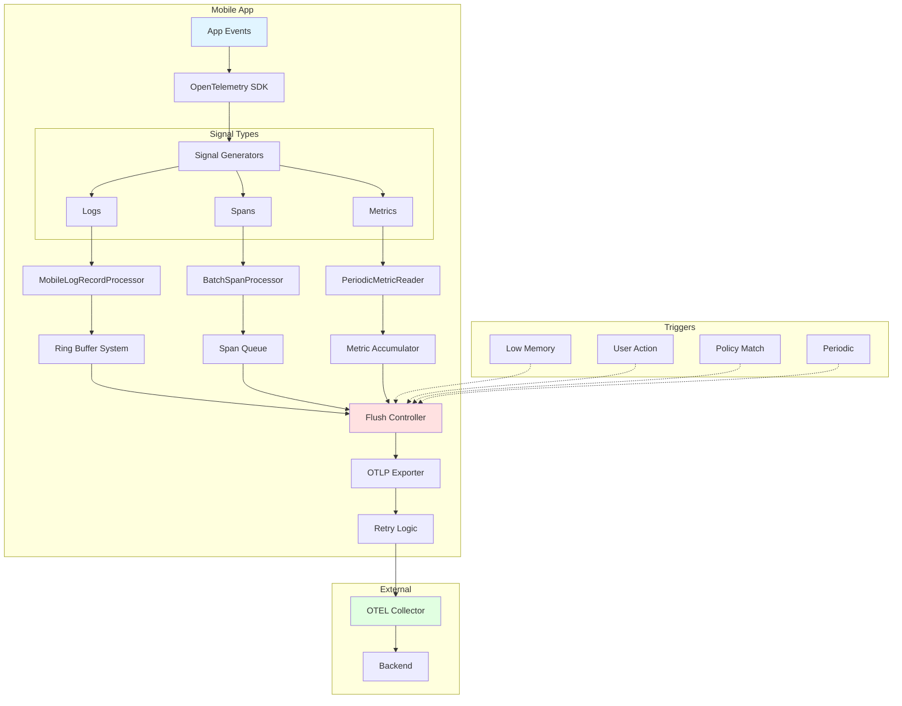
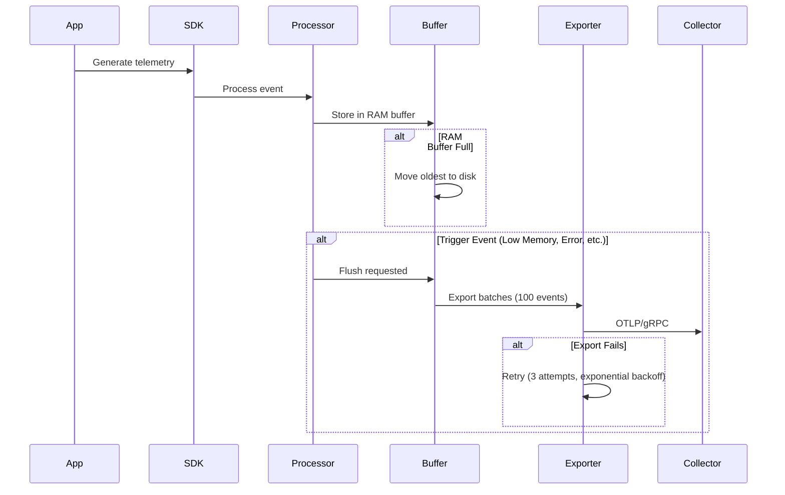
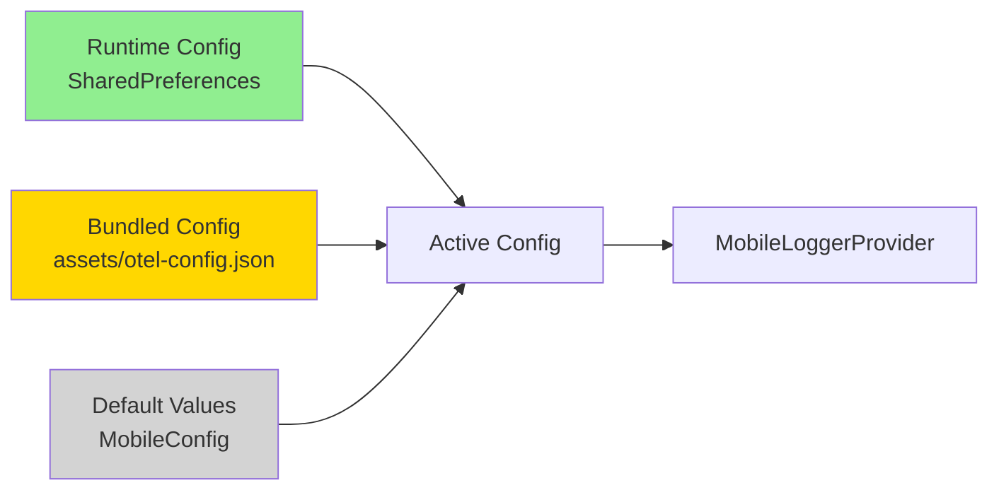

# Mobile OTel System Architecture Overview

This document provides a high-level overview of the mobile OpenTelemetry system architecture, focusing on the data flow from capture through buffering to transmission.

## System Overview

## Key Components

### 1. Signal Capture
- **Logs**: Captured via `MobileLogRecordProcessor` with two-tier ring buffer
- **Spans**: Captured via `BatchSpanProcessor` with queue-based buffering
- **Metrics**: Captured via `PeriodicMetricReader` with accumulation

### 2. Buffering Strategy
- **Logs**: RAM Buffer (5,000 events) → Disk Buffer (50 MB, 24h TTL)
- **Spans**: In-memory queue (10,000 spans in CONDITIONAL mode)
- **Metrics**: Accumulation until export or flush

### 3. Export Modes
- **CONDITIONAL**: Export only on triggers (errors, low memory, manual flush)
- **CONTINUOUS**: Periodic export (spans: 30s, metrics: 60s)
- **HYBRID**: Balanced (2x intervals + trigger-based)

### 4. Flush Triggers
- **Low Memory Detection**: Immediate capture and flush
- **Policy Match**: Workflow-triggered flush (UI freeze, errors, etc.)
- **Manual**: User-initiated via `forceFlush()`
- **Periodic**: Scheduled exports (CONTINUOUS/HYBRID modes)

## Default Batch Sizes

### On Flush (Default Limits)

| Signal Type | Default Batch Size | Source |
|-------------|-------------------|--------|
| **Logs** | Up to 5,000 events (RAM) + disk buffer (50 MB) | MobileLogRecordProcessor |
| **Spans** | Up to 10,000 spans (CONDITIONAL mode) or 2,048 (SDK default) | BatchSpanProcessor |
| **Metrics** | All accumulated metrics since last export | PeriodicMetricReader |

### Export Batching
- Logs exported in **batches of 100 events** at a time
- Spans exported per SDK configuration
- Metrics exported as complete snapshot

## Data Flow Sequence

## Configuration Hierarchy

**Priority**: Runtime > Bundled > Defaults

## Next Steps

For detailed views of specific subsystems, see:
- [02-ring-buffer-architecture.md](02-ring-buffer-architecture.md) - Ring buffer implementation
- [03-flush-behavior.md](03-flush-behavior.md) - Flush triggers and behavior
- [04-low-memory-handling.md](04-low-memory-handling.md) - Low memory detection and recovery
- [05-metrics-capture.md](05-metrics-capture.md) - Metrics capture and ring buffer proposal
