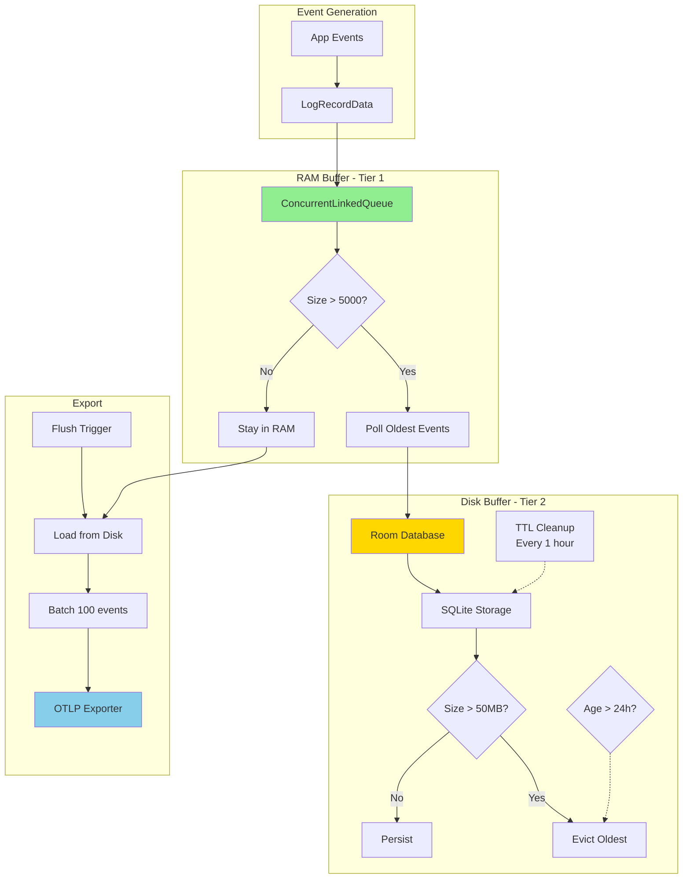
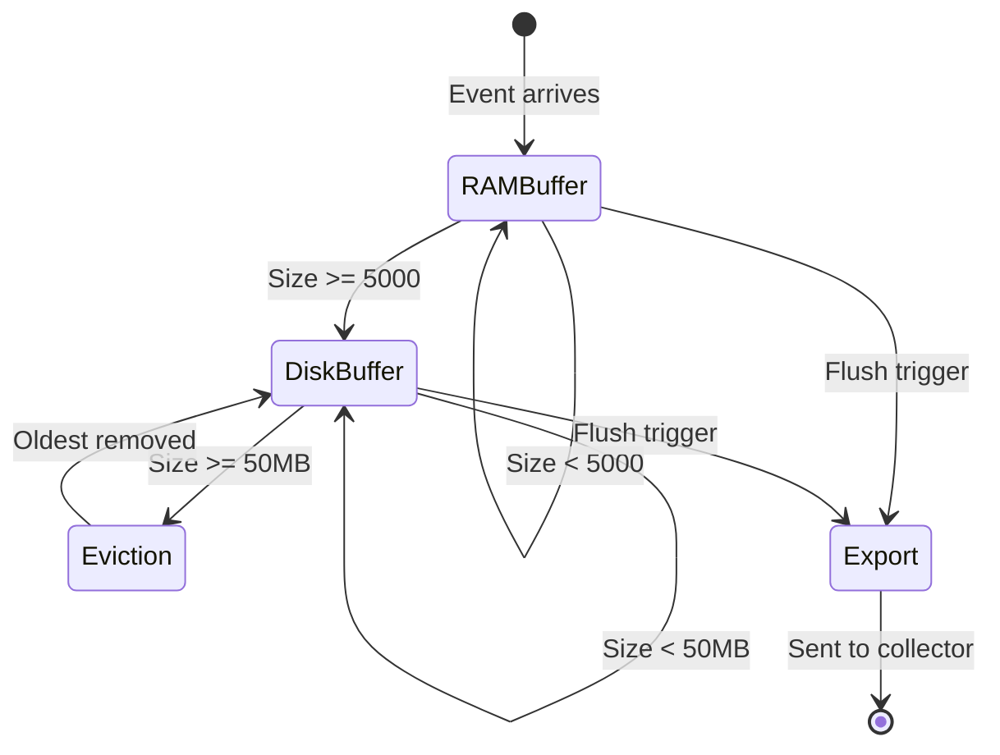
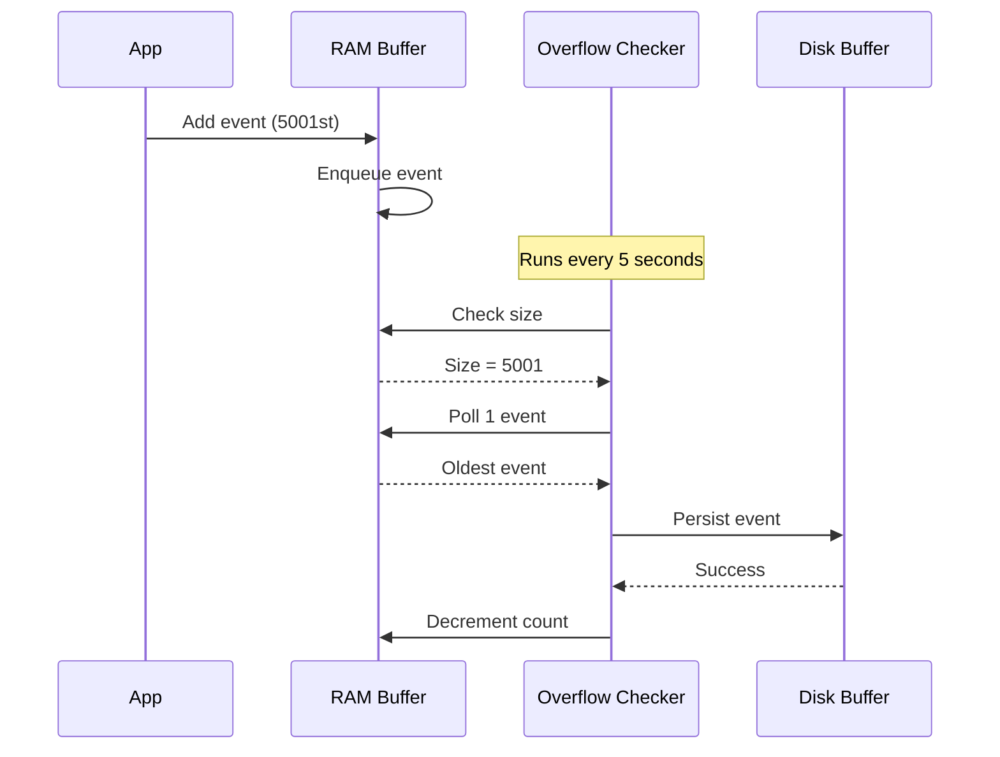
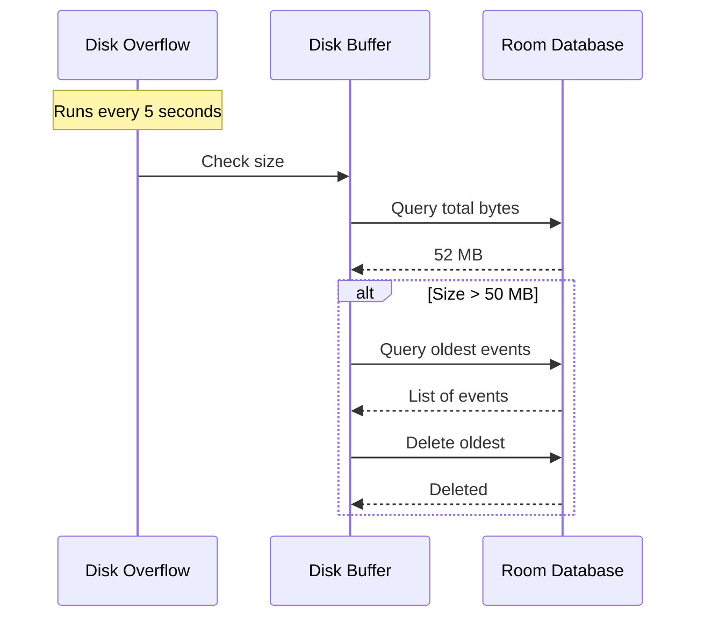
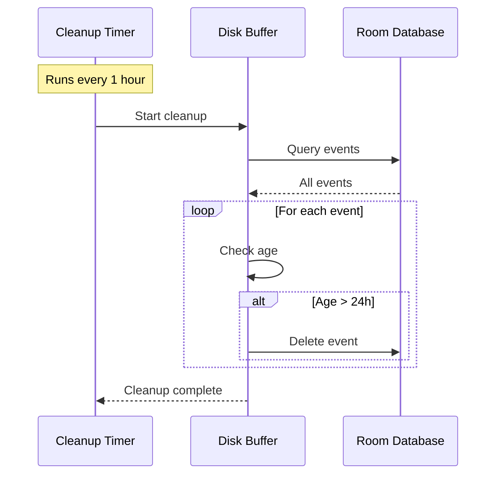
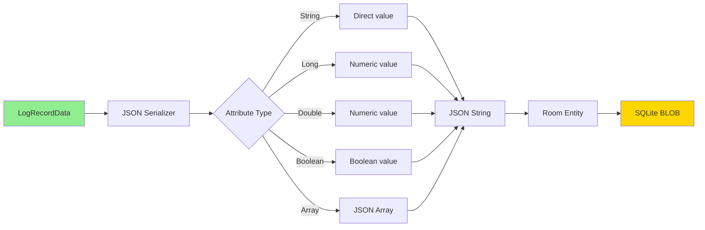
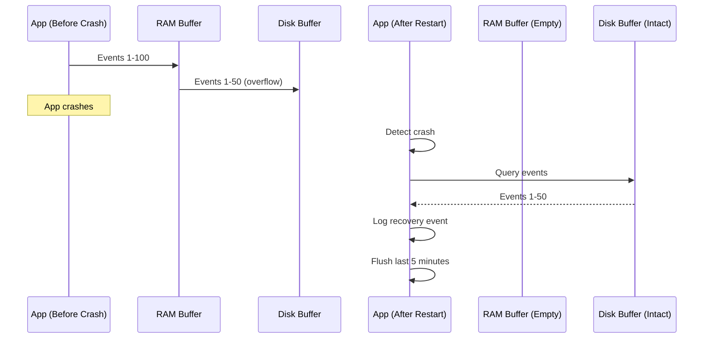
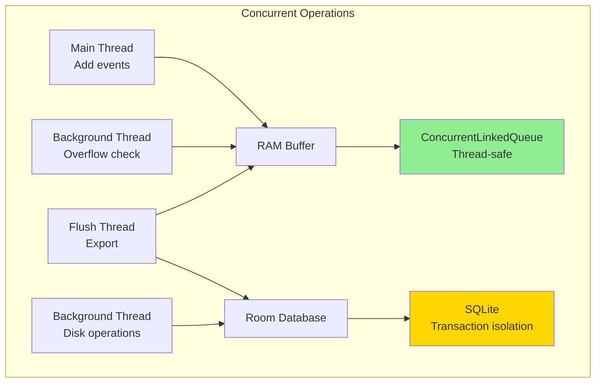

# Ring Buffer Architecture

This document details the two-tier ring buffer system used for log event buffering, providing crash-resilient storage and efficient memory management.

## Two-Tier Ring Buffer System



## Buffer Specifications

### RAM Buffer (Tier 1)
- **Type**: `ConcurrentLinkedQueue<LogRecordData>`
- **Default Capacity**: 5,000 events
- **Storage**: Volatile (lost on crash)
- **Performance**: Very fast (in-memory)
- **Thread Safety**: Concurrent access supported
- **Overflow Strategy**: Move oldest to Tier 2

### Disk Buffer (Tier 2)
- **Type**: Room database (SQLite)
- **Default Capacity**: 50 MB
- **Storage**: Persistent (survives crashes)
- **Performance**: Slower than RAM (disk I/O)
- **Thread Safety**: Room handles synchronization
- **Overflow Strategy**: Evict oldest events (FIFO)
- **TTL**: 24 hours (configurable)

## Buffer State Machine



## Overflow Management

### RAM Buffer Overflow



### Disk Buffer Overflow



## TTL Cleanup



## Serialization

### LogRecordData to JSON



### Fields Preserved
- Timestamp (nanoseconds)
- Severity
- Body (log message)
- Attributes (all types)
- Resource attributes
- Instrumentation scope
- Trace context (trace ID, span ID)

## Configuration

### Default Configuration
```kotlin
MobileConfig(
    ramBufferSize = 5000,           // RAM capacity
    diskBufferMb = 50,              // Disk capacity
    diskBufferTtlHours = 24,        // Event expiration
    // ... other settings
)
```

### Tuning Guidelines

| Scenario | RAM Size | Disk Size | TTL |
|----------|----------|-----------|-----|
| **Low traffic app** | 1,000 | 10 MB | 24h |
| **Standard app** | 5,000 | 50 MB | 24h |
| **High traffic app** | 10,000 | 100 MB | 12h |
| **Debug/testing** | 10,000 | 200 MB | 72h |

## Memory Usage Estimates

### RAM Buffer
- **Per event**: ~500 bytes (average)
- **5,000 events**: ~2.5 MB
- **10,000 events**: ~5 MB

### Disk Buffer
- **Per event**: ~600 bytes (with JSON overhead)
- **50 MB**: ~85,000 events
- **100 MB**: ~170,000 events

## Crash Recovery



**Note**: RAM buffer events (51-100) are lost, but disk buffer (1-50) survives.

## Performance Characteristics

| Operation | RAM Buffer | Disk Buffer |
|-----------|-----------|-------------|
| **Write** | <1ms | 5-10ms |
| **Read** | <1ms | 10-20ms |
| **Overflow check** | <1ms | 100-200ms |
| **TTL cleanup** | N/A | 500ms-2s |
| **Flush (100 events)** | <5ms | 50-100ms |

## Thread Safety



## Related Documentation
- [03-flush-behavior.md](03-flush-behavior.md) - How flush triggers work with ring buffer
- [04-low-memory-handling.md](04-low-memory-handling.md) - Buffer behavior under memory pressure
