# Flush Behavior and Triggers

This document details how flush operations work across different signal types (logs, spans, metrics) and the various triggers that initiate a flush.

## Flush Architecture

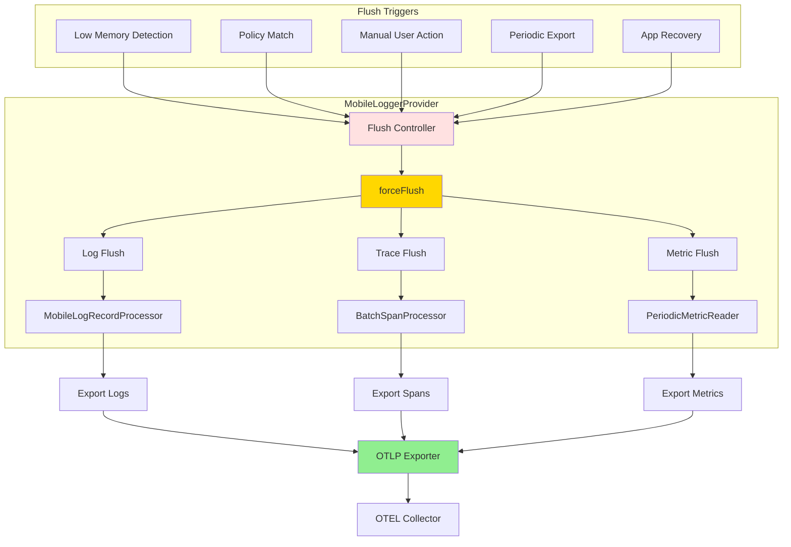

## Flush Implementation

### Master Flush Method

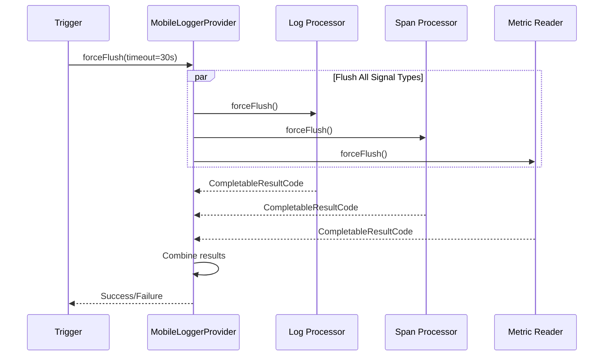

**Location**: [MobileLoggerProvider.kt:288-326](../../otel-android-mobile/src/main/java/io/opentelemetry/android/mobile/MobileLoggerProvider.kt#L288-L326)

### Log Flush Process

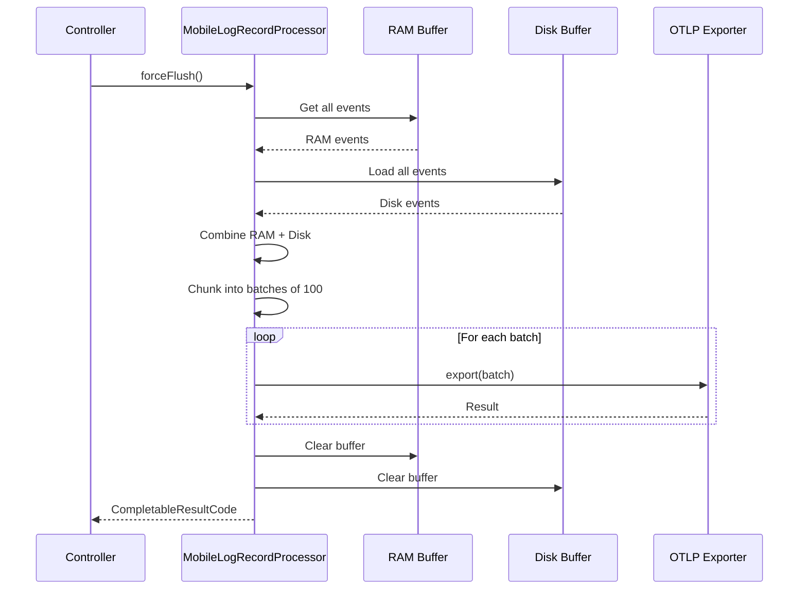

**Location**: [MobileLogRecordProcessor.kt:318-366](../../otel-android-mobile/src/main/java/io/opentelemetry/android/mobile/buffering/MobileLogRecordProcessor.kt#L318-L366)

## Flush Types

### 1. Full Flush (forceFlush)

Exports **ALL** buffered events from RAM and disk.

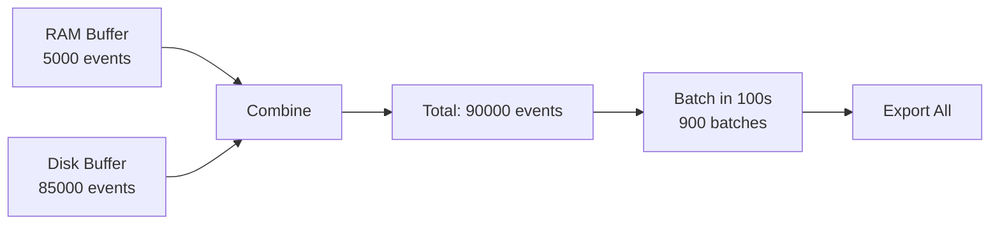

**Use Cases**:
- Manual flush button
- App shutdown
- Low memory warning
- Critical error detection

### 2. Window Flush (flushWindow)

Exports only events from a **specific time window** (e.g., last 2 minutes).

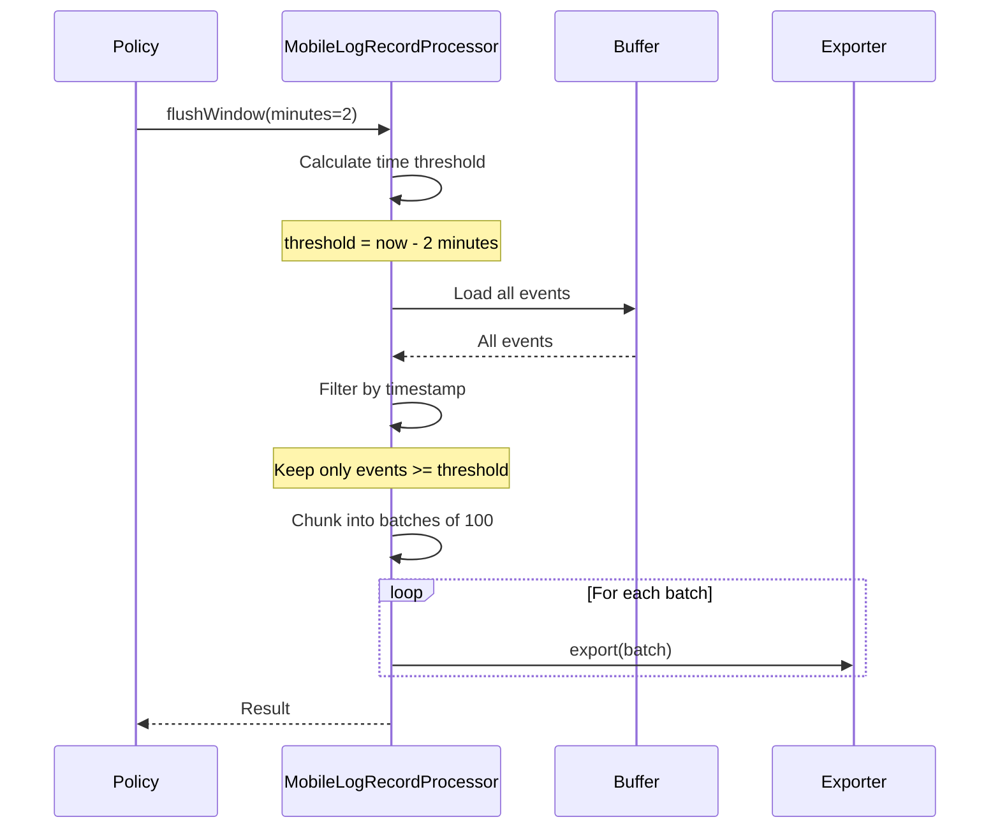

**Location**: [MobileLogRecordProcessor.kt:208-273](../../otel-android-mobile/src/main/java/io/opentelemetry/android/mobile/buffering/MobileLogRecordProcessor.kt#L208-L273)

**Use Cases**:
- UI freeze detection (flush last 2 minutes)
- Error context capture
- Policy-based selective export

## Flush Triggers

### 1. Low Memory Detection

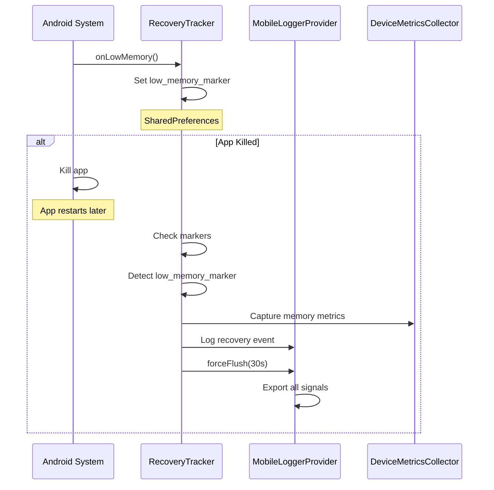

**Location**: [RecoveryTracker.kt:66-150](../../otel-android-mobile/src/main/java/io/opentelemetry/android/mobile/autocapture/RecoveryTracker.kt#L66-L150)

**Metrics Captured**:
- `device.memory.used_mb`
- `device.memory.available_mb`
- `device.memory.low_memory` (0 or 1)

### 2. Policy Match (Workflow Trigger)

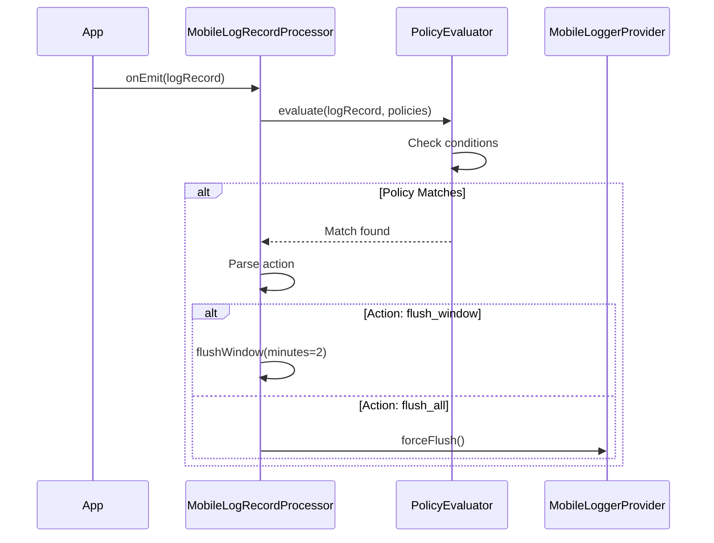

**Example Policy**:
```yaml
policies:
  - id: ui-freeze
    match:
      attributes:
        event.name: {equals: "ui.freeze"}
        duration_ms: {gt: 2000}
    actions:
      - type: flush_window
        parameters: {window_minutes: 2}
```

### 3. Manual User Action

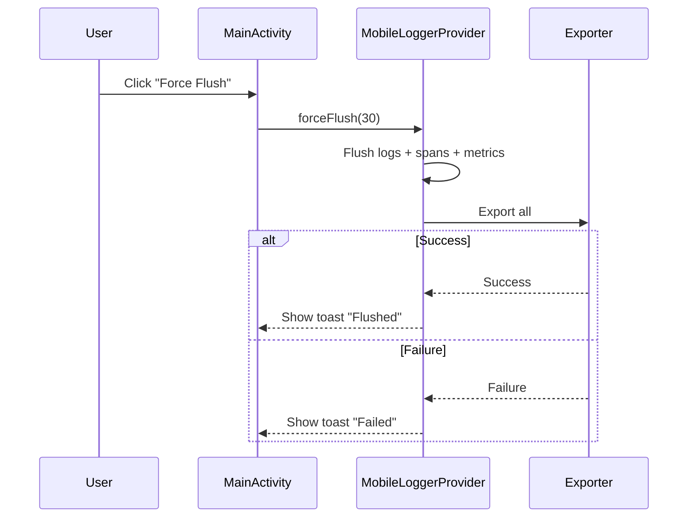

**Location**: [MainActivity.kt](../../examples/demo-app/android/src/main/java/io/opentelemetry/android/demo/MainActivity.kt) - Force Flush button

### 4. Periodic Export (CONTINUOUS/HYBRID modes)

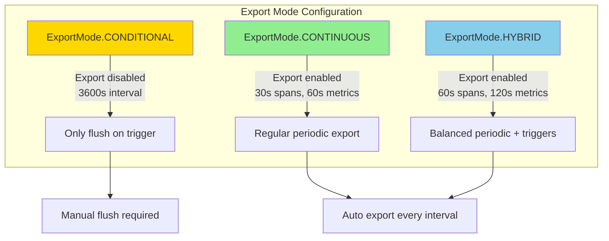

**Location**: [MobileLoggerProvider.kt:121-167](../../otel-android-mobile/src/main/java/io/opentelemetry/android/mobile/MobileLoggerProvider.kt#L121-L167)

### 5. App Recovery (Crash/Force Quit)

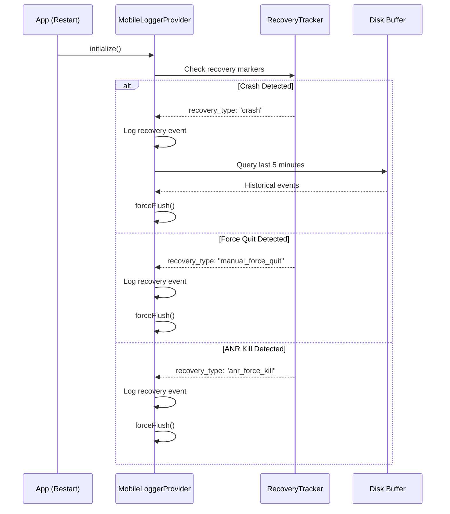

**Recovery Types**:
1. `crash` - Uncaught exception
2. `manual_force_quit` - User clicked Force Quit button
3. `anr_force_kill` - User closed during ANR dialog
4. `low_memory_kill` - Android killed due to memory
5. `system_force_kill` - Swipe to kill
6. `clean_start` - Normal launch

## Default Batch Sizes

### Logs
- **RAM Buffer**: 5,000 events
- **Disk Buffer**: 50 MB (~85,000 events)
- **Export Batch Size**: 100 events per batch
- **Total on Full Flush**: Up to 90,000 events

### Spans
- **CONDITIONAL Mode**: 10,000 spans max
- **CONTINUOUS/HYBRID Mode**: 2,048 spans (SDK default)
- **Export**: Per SDK configuration

### Metrics
- **Accumulation**: All metrics since last export
- **Export**: Complete snapshot
- **No batching**: Sent as single payload

## Flush Performance

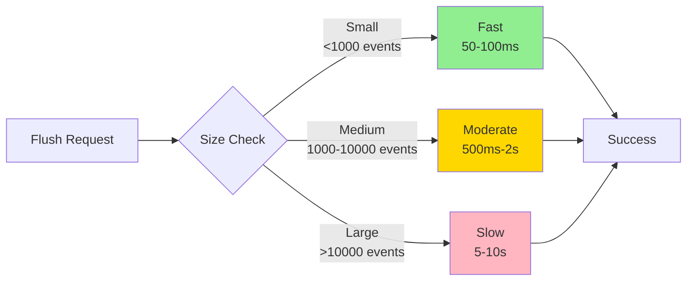

### Optimization Tips
1. Use **window flush** instead of full flush when possible
2. Tune buffer sizes for expected traffic
3. Use **CONDITIONAL mode** for production (battery-friendly)
4. Monitor flush duration via metrics

## Retry Logic

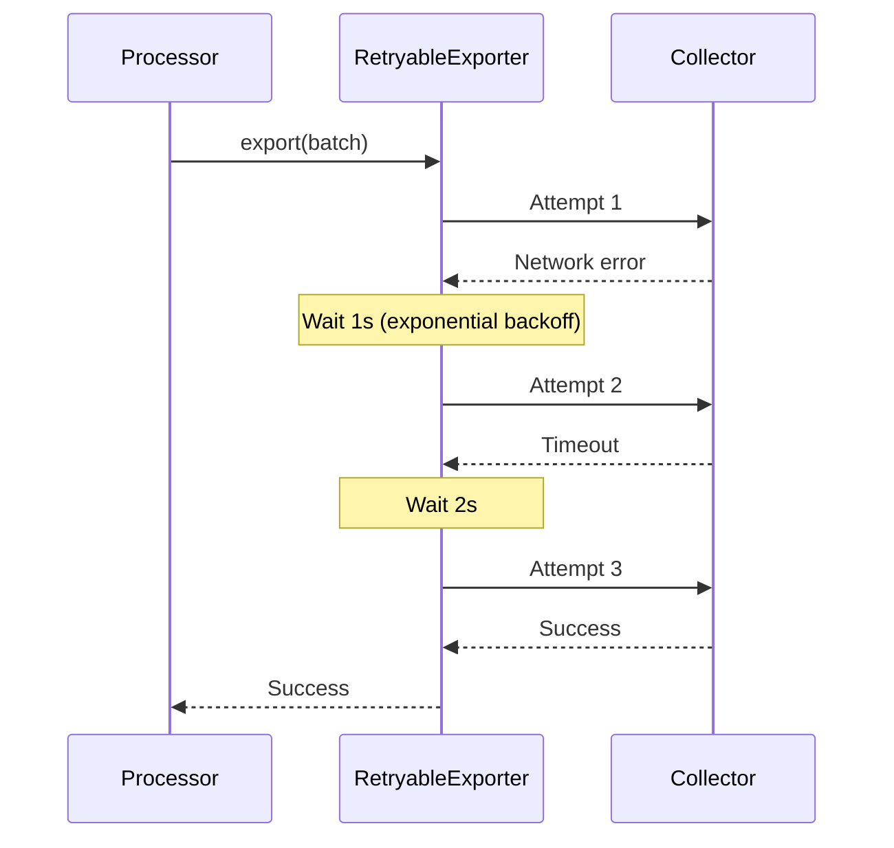

**Configuration**:
- **Max Retries**: 3 (configurable)
- **Backoff**: 1s → 2s → 4s → 8s (capped at 60s)
- **Timeout**: 30s per attempt (configurable)

**Location**: [RetryableExporter.kt](../../otel-android-mobile/src/main/java/io/opentelemetry/android/mobile/buffering/RetryableExporter.kt)

## Related Documentation
- [02-ring-buffer-architecture.md](02-ring-buffer-architecture.md) - Buffer implementation details
- [04-low-memory-handling.md](04-low-memory-handling.md) - Low memory trigger specifics
- [05-metrics-capture.md](05-metrics-capture.md) - Metrics flush behavior
