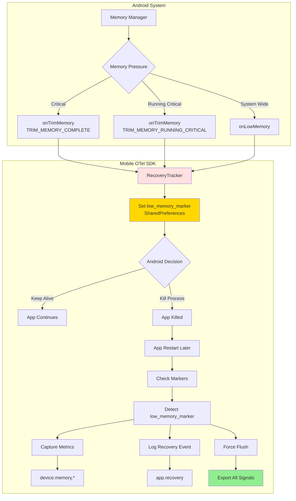
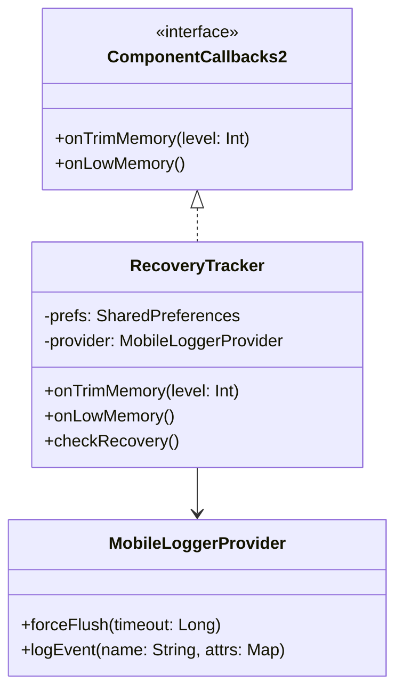
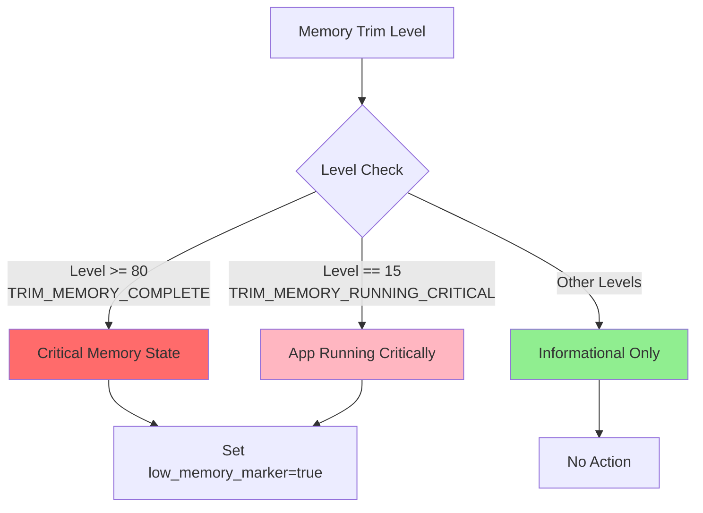
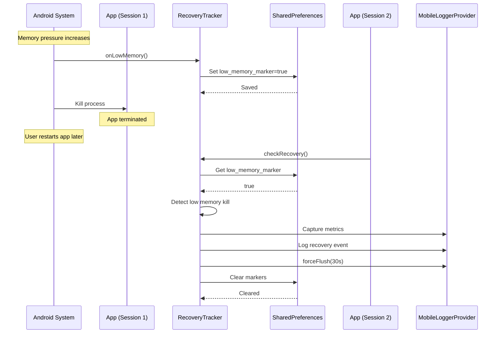
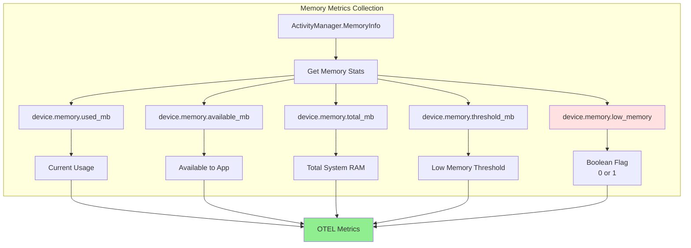
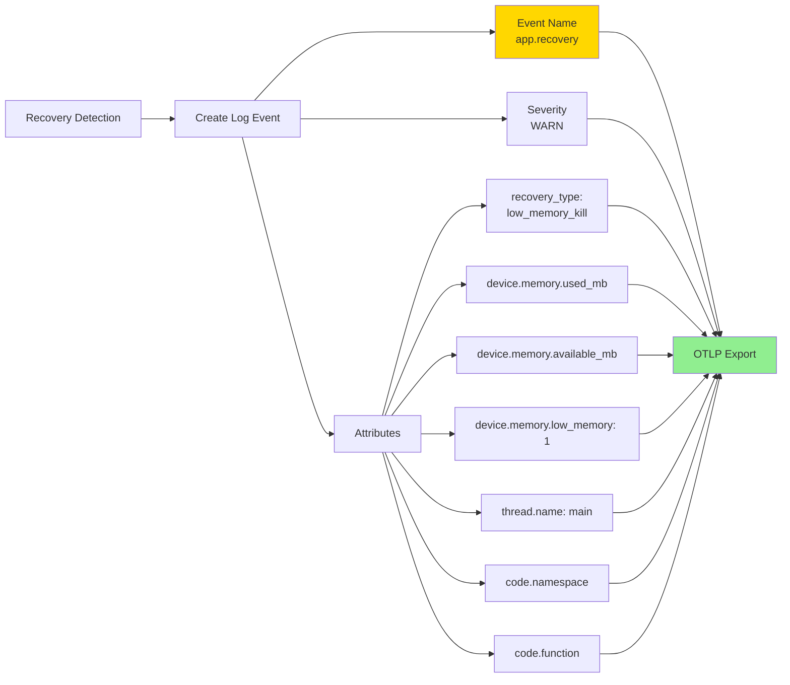
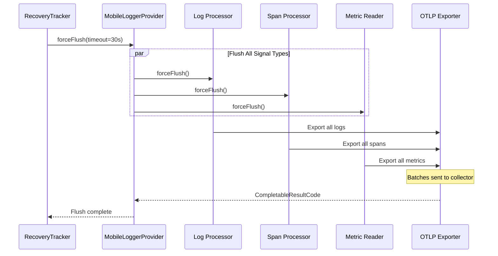
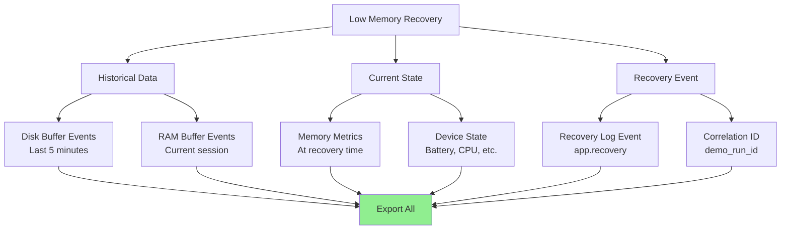
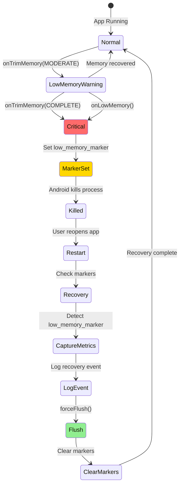
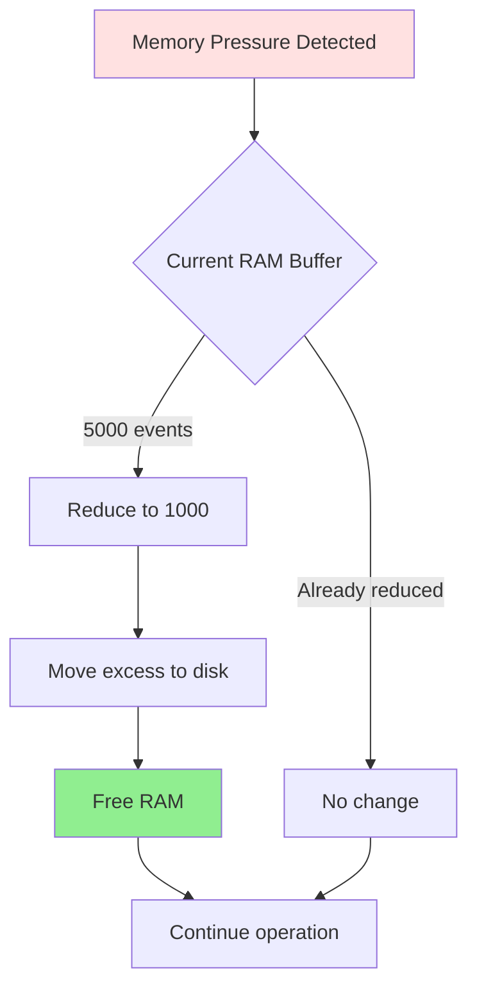

# Low Memory Handling Architecture

This document details how the system detects, responds to, and recovers from low memory conditions on Android.

## Low Memory Detection Flow



## Android Memory Callbacks

### ComponentCallbacks2 Integration



**Location**: [RecoveryTracker.kt:66-78](../../otel-android-mobile/src/main/java/io/opentelemetry/android/mobile/autocapture/RecoveryTracker.kt#L66-L78)

### Memory Trim Levels



**Android Trim Levels**:
- `TRIM_MEMORY_COMPLETE` (80): System critically low, app in background
- `TRIM_MEMORY_RUNNING_CRITICAL` (15): System critically low, app in foreground
- Other levels: Informational hints for memory optimization

## Recovery Detection Sequence



## Memory Metrics Capture

### Device Memory Metrics



**Location**: [DeviceMetricsCollector.kt:92-117](../../otel-android-mobile/src/main/java/io/opentelemetry/android/mobile/metrics/DeviceMetricsCollector.kt#L92-L117)

### Metric Definitions

| Metric Name | Type | Description | Unit |
|------------|------|-------------|------|
| `device.memory.used_mb` | Counter | Memory currently used by system | MB |
| `device.memory.available_mb` | Counter | Memory available to app | MB |
| `device.memory.total_mb` | Counter | Total system RAM | MB |
| `device.memory.threshold_mb` | Counter | Low memory warning threshold | MB |
| `device.memory.low_memory` | Counter | Low memory state detected (0/1) | boolean |

## Low Memory Event Log



### Example Log Event

```json
{
  "timestamp": 1706123456789000000,
  "severity": "WARN",
  "body": "app.recovery",
  "attributes": {
    "recovery_type": "low_memory_kill",
    "device.memory.used_mb": 3456,
    "device.memory.available_mb": 234,
    "device.memory.low_memory": 1,
    "device.memory.threshold_mb": 512,
    "thread.name": "main",
    "code.namespace": "io.opentelemetry.android.mobile.autocapture",
    "code.function": "checkRecovery"
  },
  "resource": {
    "service.name": "my-app",
    "service.version": "1.0.0",
    "device.manufacturer": "Samsung",
    "device.model": "SM-G998B"
  }
}
```

## Flush Behavior on Low Memory

### Immediate Flush Trigger



### Data Captured on Low Memory Recovery



## Memory Pressure Response Strategy



## Prevention and Mitigation

### Buffer Size Adjustment

Under memory pressure, the system can dynamically adjust buffer sizes:



**Future Enhancement**: Dynamic buffer resizing based on available memory.

## Testing Low Memory Scenarios

### Simulated Low Memory

```kotlin
// In demo app - Low Memory scenario
fun triggerLowMemory() {
    // Set marker
    prefs.edit().putBoolean("low_memory_marker", true).apply()

    // Log pre-kill event
    logger.logEvent("app.low_memory", mapOf(
        "error.type" to "memory.exhaustion",
        "trigger" to "manual_test"
    ))

    // Simulate memory allocation
    val memoryHog = mutableListOf<ByteArray>()
    repeat(100) {
        memoryHog.add(ByteArray(1024 * 1024 * 100)) // 100 MB chunks
    }
}
```

**Location**: [MainActivity.kt](../../examples/demo-app/android/src/main/java/io/opentelemetry/android/demo/MainActivity.kt) - Low Memory button

### Recovery Testing

```kotlin
// On app restart
fun testRecovery() {
    val tracker = RecoveryTracker(context, provider)
    tracker.checkRecovery()

    // Should detect:
    // 1. low_memory_marker = true
    // 2. Log recovery event
    // 3. Capture memory metrics
    // 4. Trigger flush
}
```

## Performance Impact

### Memory Overhead

| Component | Normal | Low Memory Mode |
|-----------|--------|-----------------|
| RecoveryTracker | ~1 KB | ~1 KB |
| SharedPreferences | ~500 bytes | ~500 bytes |
| Memory metrics | ~2 KB | ~2 KB |
| **Total** | **~3.5 KB** | **~3.5 KB** |

**Negligible impact** - designed to work under memory pressure.

### CPU Overhead

- Memory metrics collection: <5ms
- Marker check on startup: <10ms
- Recovery event logging: <20ms
- Total overhead: **<35ms on app start**

## Configuration

```kotlin
MobileConfig(
    // Memory-related settings
    ramBufferSize = 5000,           // Reduce if memory constrained
    diskBufferMb = 50,              // Disk fallback
    exportTimeoutSeconds = 30,      // Flush timeout

    // Enable low memory tracking
    captureDeviceMetrics = true,
    deviceMetricsConfig = DeviceMetricsConfig(
        captureMemory = true,
        captureReasons = setOf(
            CaptureReason.LOW_MEMORY,
            CaptureReason.APP_START
        )
    )
)
```

## Related Documentation
- [02-ring-buffer-architecture.md](02-ring-buffer-architecture.md) - Buffer survival across kills
- [03-flush-behavior.md](03-flush-behavior.md) - Flush trigger details
- [05-metrics-capture.md](05-metrics-capture.md) - Metrics collection system
