# Metrics Capture and Ring Buffer Proposal

This document describes the current metrics capture system and proposes an enhancement to use a ring buffer for metrics, similar to the log system.

## Current Metrics Architecture

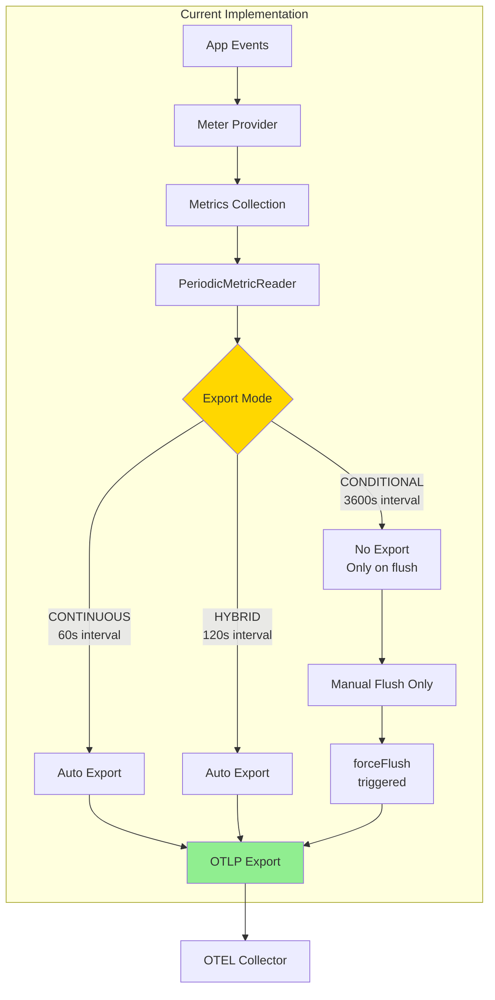

**Location**: [MobileLoggerProvider.kt:121-142](../../otel-android-mobile/src/main/java/io/opentelemetry/android/mobile/MobileLoggerProvider.kt#L121-L142)

### How Current System Works

#### Metric Collection

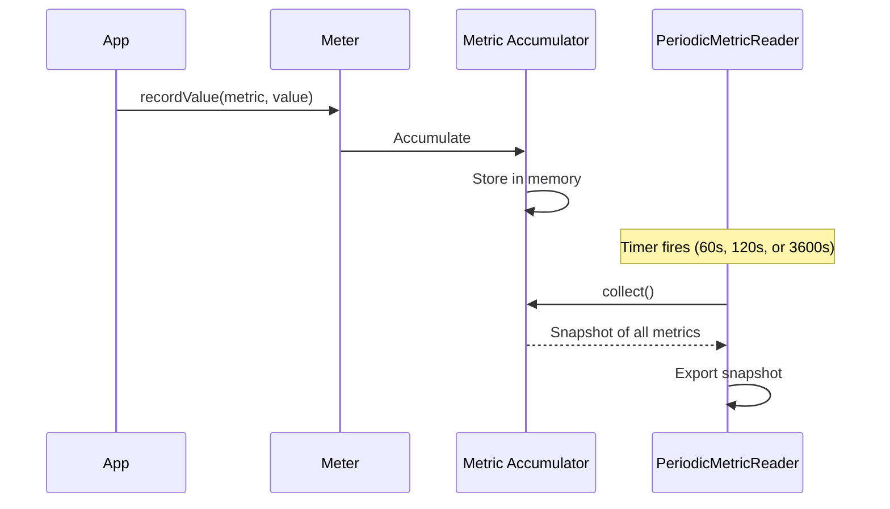

#### Current Limitations

1. **No Ring Buffer**: Metrics accumulate indefinitely until export
2. **Memory Growth**: High-cardinality metrics can consume significant memory
3. **All-or-Nothing**: Export sends all metrics (no selective export)
4. **No Historical Context**: Can't flush "last X minutes" of metrics
5. **Loss on Crash**: Accumulated metrics lost if app crashes before export

## Proposed: Metrics Ring Buffer System

### Architecture Overview

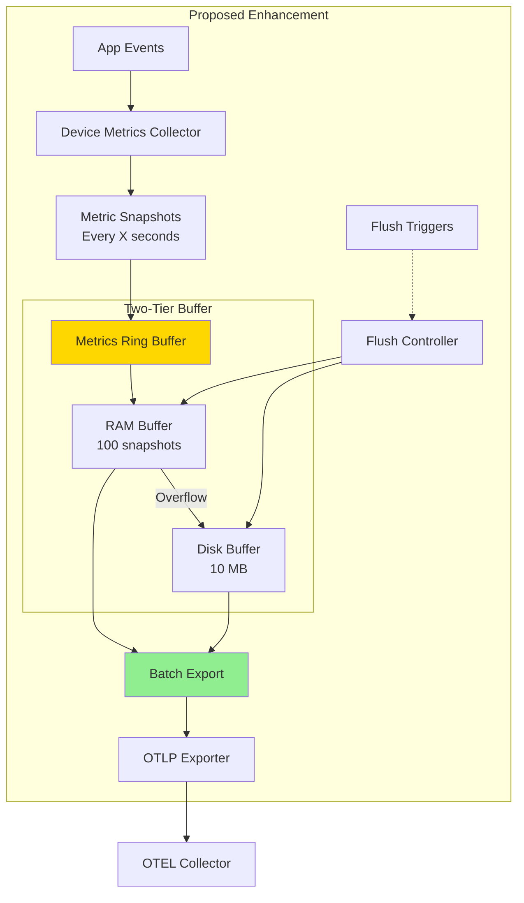

### Metrics Snapshot Structure

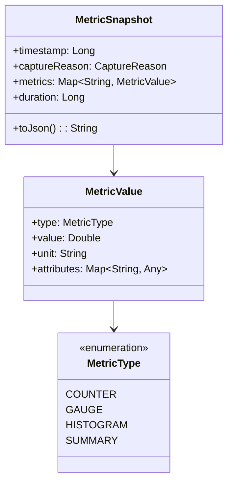

### Capture Strategy

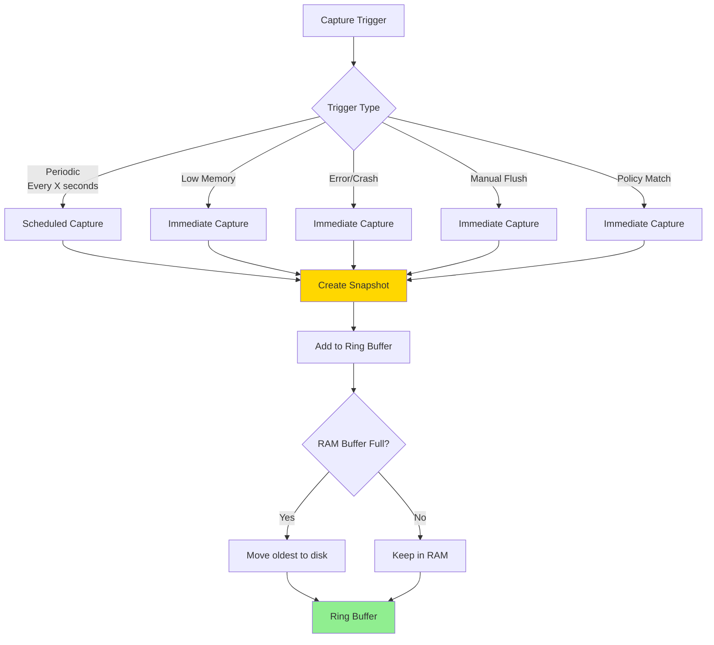

### Implementation Design

#### MetricsRingBuffer Class

```kotlin
class MetricsRingBuffer(
    private val ramBufferSize: Int = 100,  // 100 snapshots
    private val diskBufferMb: Int = 10,    // 10 MB
    private val diskBufferTtlHours: Int = 24,
    private val captureIntervalSeconds: Long = 60
) {
    private val ramBuffer = ConcurrentLinkedQueue<MetricSnapshot>()
    private val diskBuffer = DiskMetricBuffer(diskBufferMb, diskBufferTtlHours)
    private var ramBufferCount = AtomicInteger(0)

    // Capture metrics snapshot
    fun captureSnapshot(reason: CaptureReason) {
        val snapshot = collectCurrentMetrics(reason)
        ramBuffer.add(snapshot)
        ramBufferCount.incrementAndGet()

        checkOverflow()
    }

    // Flush all or window
    fun flush(windowMinutes: Int? = null): List<MetricSnapshot> {
        val ramEvents = ramBuffer.toList()
        val diskEvents = diskBuffer.loadAll()

        val allSnapshots = ramEvents + diskEvents

        return if (windowMinutes != null) {
            val threshold = System.currentTimeMillis() - (windowMinutes * 60 * 1000)
            allSnapshots.filter { it.timestamp >= threshold }
        } else {
            allSnapshots
        }
    }

    // Periodic overflow check
    private fun checkOverflow() {
        if (ramBufferCount.get() > ramBufferSize) {
            val evicted = ramBuffer.poll()
            if (evicted != null) {
                diskBuffer.persist(evicted)
                ramBufferCount.decrementAndGet()
            }
        }
    }
}
```

### Capture Frequency Configuration

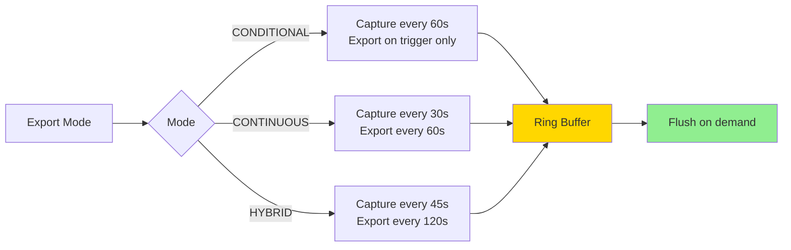

**Key Point**: Metrics are **captured periodically** into ring buffer, but **exported** based on mode and triggers.

## Comparison: Current vs Proposed

| Aspect | Current System | Proposed Ring Buffer |
|--------|---------------|---------------------|
| **Storage** | Accumulator (memory) | Two-tier ring buffer (RAM + Disk) |
| **Crash Resilience** | ❌ Lost on crash | ✅ Disk buffer survives |
| **Historical Context** | ❌ Only current snapshot | ✅ Last 100 snapshots |
| **Selective Export** | ❌ All or nothing | ✅ Window-based export |
| **Memory Growth** | ⚠️ Unbounded | ✅ Bounded (100 snapshots) |
| **Low Memory Handling** | ❌ No special handling | ✅ Immediate capture + flush |
| **Periodic Capture** | ❌ Not supported | ✅ Every X seconds |

## Flush Integration

### Unified Flush Controller

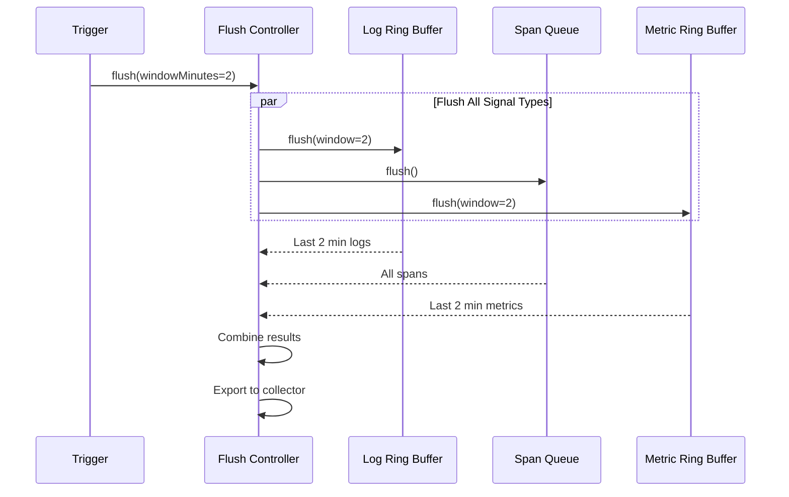

### Example: Low Memory Trigger

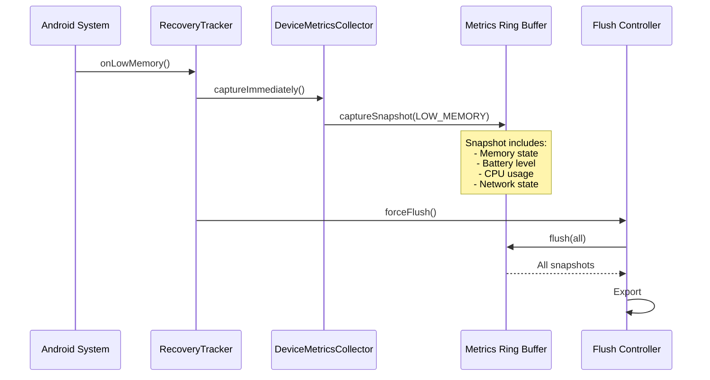

## Benefits of Ring Buffer Approach

### 1. Crash Resilience

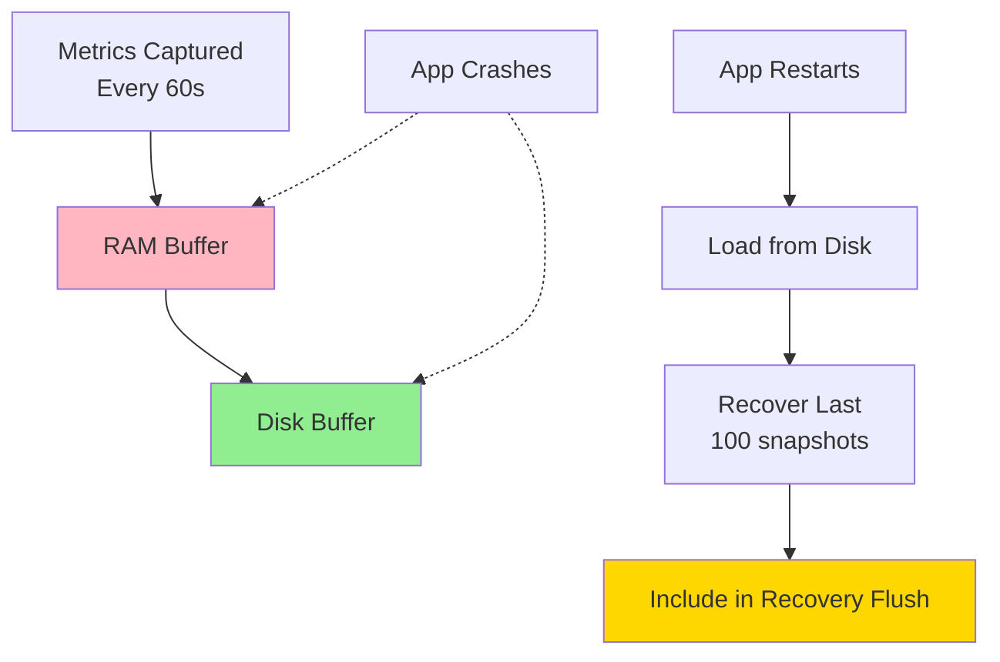

**Before**: Metrics accumulated since last export are lost
**After**: Last 100 snapshots (up to ~100 minutes) preserved

### 2. Historical Context

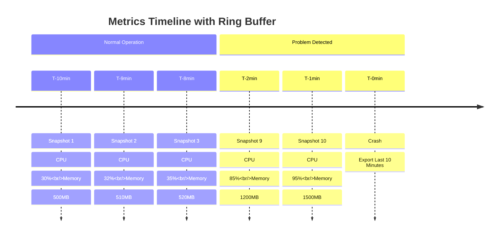

**Use Case**: When a crash occurs, automatically export last 10 minutes of metrics showing gradual memory/CPU increase leading to crash.

### 3. Selective Export

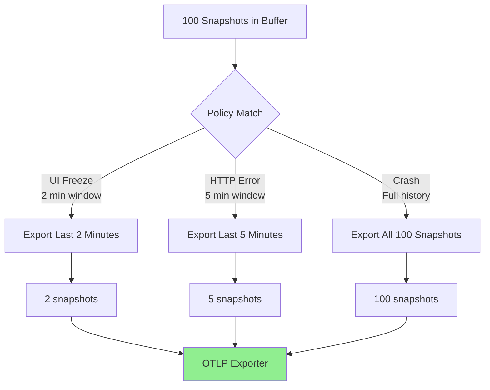

**Benefit**: Reduced bandwidth and cost - only export relevant context.

### 4. Low Memory Optimization

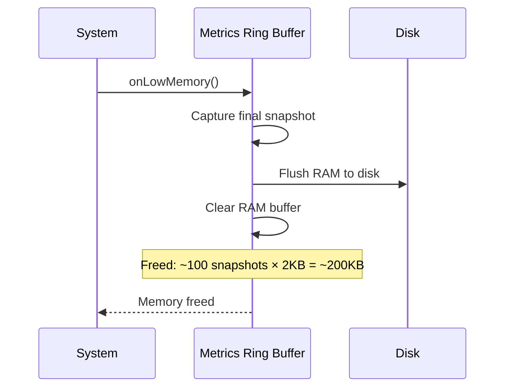

**Benefit**: Under memory pressure, flush metrics to disk and free RAM.

## Performance Characteristics

### Memory Usage

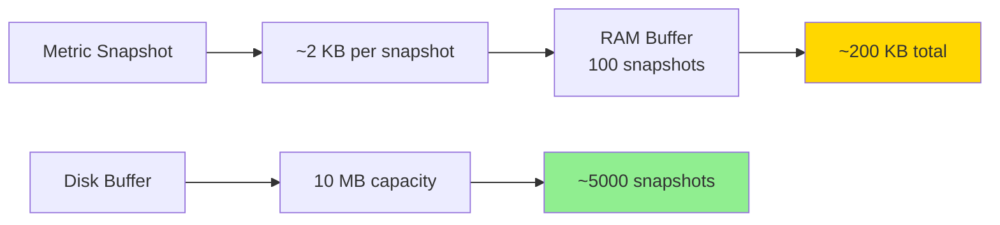

**RAM**: 200 KB (fixed, bounded)
**Disk**: Up to 10 MB (configurable)

### Capture Performance

| Operation | Time | Impact |
|-----------|------|--------|
| Capture snapshot | 5-10ms | Negligible |
| Add to RAM buffer | <1ms | Negligible |
| Overflow to disk | 10-20ms | Background thread |
| Flush (100 snapshots) | 100-200ms | Acceptable |

### Export Volume Reduction

**Before (no ring buffer)**:
- Export all accumulated metrics on every flush
- No control over volume

**After (with ring buffer)**:
- Export only relevant time window
- Example: UI freeze → export last 2 minutes (2 snapshots ~4KB)
- Reduction: 98% less data for focused events

## Configuration

```kotlin
MobileConfig(
    // Metrics ring buffer settings
    metricsRamBufferSize = 100,              // 100 snapshots
    metricsDiskBufferMb = 10,                // 10 MB
    metricsDiskBufferTtlHours = 24,          // 24 hours
    metricsCaptureIntervalSeconds = 60,      // Capture every 60s

    // Export settings (unchanged)
    exportMode = ExportMode.CONDITIONAL,
    metricExportIntervalSeconds = 60,        // Export interval (if CONTINUOUS)

    // Device metrics
    captureDeviceMetrics = true,
    deviceMetricsConfig = DeviceMetricsConfig(
        captureMemory = true,
        captureBattery = true,
        captureCpu = true,
        captureNetwork = true,
        captureReasons = setOf(
            CaptureReason.SCHEDULED_FLUSH,
            CaptureReason.LOW_MEMORY,
            CaptureReason.ERROR,
            CaptureReason.CRASH,
            CaptureReason.MANUAL_FLUSH
        )
    )
)
```

## Implementation Phases

### Phase 1: Core Ring Buffer (2-3 days)
- [ ] Implement `MetricsRingBuffer` class
- [ ] Implement `MetricSnapshot` data structure
- [ ] Implement RAM buffer (ConcurrentLinkedQueue)
- [ ] Implement overflow logic

### Phase 2: Disk Persistence (2-3 days)
- [ ] Implement `DiskMetricBuffer` with Room
- [ ] JSON serialization for `MetricSnapshot`
- [ ] TTL cleanup task
- [ ] Size-based eviction

### Phase 3: Integration (2-3 days)
- [ ] Integrate with `DeviceMetricsCollector`
- [ ] Integrate with `MobileLoggerProvider.forceFlush()`
- [ ] Integrate with `PolicyEvaluator` for window flush
- [ ] Update `PeriodicMetricReader` to use ring buffer

### Phase 4: Testing (2-3 days)
- [ ] Unit tests for `MetricsRingBuffer`
- [ ] Unit tests for `DiskMetricBuffer`
- [ ] Integration tests with flush triggers
- [ ] Crash recovery tests

### Phase 5: Demo Integration (1 day)
- [ ] Update demo app scenarios
- [ ] Add metrics visualization
- [ ] Document new features

**Total Estimate**: 9-13 days

## Migration Strategy

### Backward Compatibility

```kotlin
// Old API (still works)
provider.forceFlush()  // Exports current metrics + all logs/spans

// New API (enhanced)
provider.forceFlush(windowMinutes = 2)  // Exports last 2 minutes

// Configuration flag
MobileConfig(
    useMetricsRingBuffer = true  // Enable new behavior
)
```

### Gradual Rollout
1. Implement ring buffer as optional feature (flag: `useMetricsRingBuffer`)
2. Test in demo app and internal apps
3. Enable by default in next major version
4. Deprecate old accumulator-only mode

## Related Documentation
- [02-ring-buffer-architecture.md](02-ring-buffer-architecture.md) - Log ring buffer implementation
- [03-flush-behavior.md](03-flush-behavior.md) - Flush behavior and triggers
- [04-low-memory-handling.md](04-low-memory-handling.md) - Low memory scenarios
